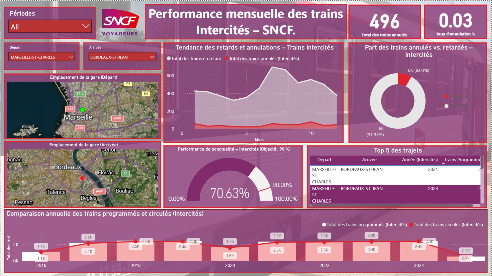
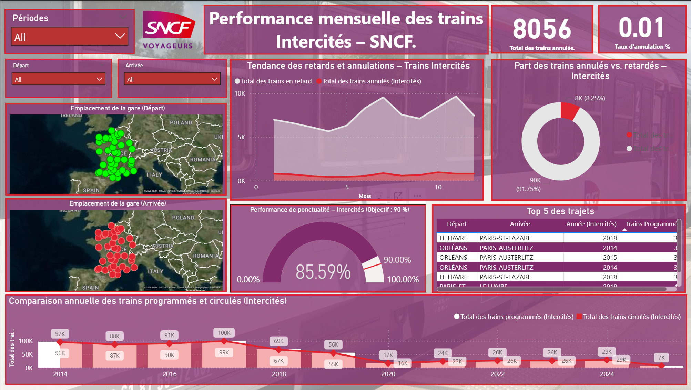
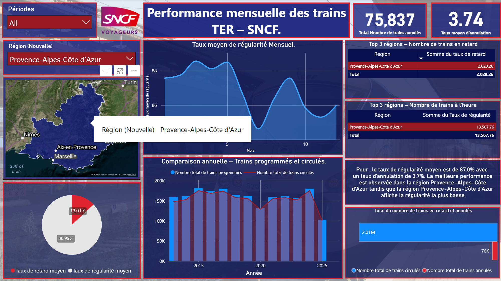
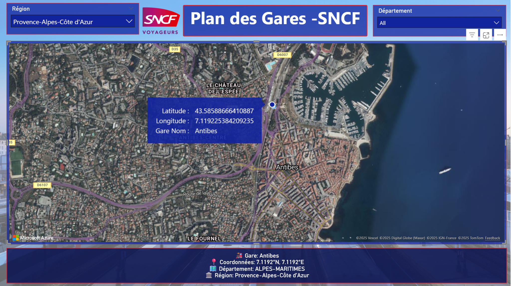
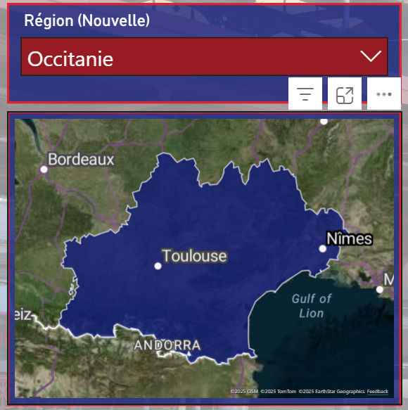

# Performance mensuelle des trains TER et Intercités – SNCF

Ce dépôt présente un projet de visualisation construit par **Raju**, étudiant en analyse de données. Il s'appuie sur les données ouvertes de la SNCF pour suivre la performance mensuelle des trains régionaux **TER** et des services longue distance **Intercités**. 
L'objectif est de fournir des tableaux de bord interactifs avec Power BI afin de comprendre la ponctualité, les retards et les annulations, de comparer les régions et les axes, et de mieux raconter l'histoire derrière les chiffres.

## ✨ Points clés

* **Deux tableaux de bord** : un pour les services **TER** et un pour les **Intercités**. 
  Le tableau de bord TER se concentre sur la régularité régionale et permet de filtrer par période et par région. 
  Le tableau de bord Intercités se concentre sur les grands axes (Marseille–Bordeaux, Le Havre–Paris, etc.) et propose un suivi global ou par trajet.
* **Indicateurs clés** : 
  – **Ponctualité / régularité** : part des trains arrivant à l’heure au terminus (voir la définition ci‑dessous). 
  – **Retards** : nombre et taux de trains arrivant en retard. 
  – **Annulations** : nombre et taux d’annulations (annulation totale ou partielle). 
  – **Programmés vs circulés** : comparaison des trains prévus à l’horaire et de ceux qui ont effectivement circulé.
* **Comparaisons** : 
  – **Par région** pour les TER afin d’identifier les meilleurs et les moins bons niveaux de régularité. 
  – **Par corridor** pour les Intercités (ex. Marseille ↔ Bordeaux, Paris ↔ Austerlitz, etc.).
* **Cartographie** : 
  – Carte des **gares** avec des info‑bulles (lat/long et nom) issues du jeu de données *liste‑des‑gares*. 
  – Carte des **régions** pour visualiser les zones TER et naviguer sur le territoire.
* **Storytelling** : 
  – Mesures DAX générant des résumés automatiques de la situation actuelle (évolution de la régularité, régions les plus performantes, etc.). 
  – Textes dynamiques pour guider la lecture du tableau de bord.
* **Approche pédagogique** : 
  – Modèle de données lisible avec une table calendrier (année, trimestre, mois, combinaison mois‑année). 
  – DAX commenté et étapes de transformation reproductibles via Power Query. 
  – Projet à but éducatif, sans finalité commerciale.

## 🗂 Jeux de données (Open Data SNCF)

| Jeu | Description | Lien |
|---|---|---|
| **regularite‑mensuelle‑ter** | Regularité mensuelle des TER depuis 2013 : nombre de trains programmés, circulés, annulés et en retard, plus le taux de régularité par région. | [ressources.data.sncf.com/explore/dataset/regularite-mensuelle-ter/information/](https://ressources.data.sncf.com/explore/dataset/regularite-mensuelle-ter/information/) |
| **regularite‑mensuelle‑intercites** | Regularité mensuelle des Intercités depuis 2014 : nombres de trains programmés, circulés, annulés et en retard, plus le taux de régularité par trajet longue distance. | [ressources.data.sncf.com/explore/dataset/regularite-mensuelle-intercites/information/](https://ressources.data.sncf.com/explore/dataset/regularite-mensuelle-intercites/information/) |
| **liste‑des‑gares** | Répertoire des gares avec localisation (latitude/longitude), commune, département et région ; utilisé pour la cartographie des gares. | [data.sncf.com/explore/dataset/liste-des-gares/information/](https://data.sncf.com/explore/dataset/liste-des-gares/information/) |

Les données sont publiques et réutilisées dans un cadre pédagogique. 
Aucune utilisation commerciale n'est envisagée.

## 🗌 Méthodes et indicateurs

Les indicateurs ont été construits à partir des jeux de données bruts. Voici quelques définitions :

- **Programmés vs circulés** : comparaison du nombre de trains prévus par la grille horaire (programmés) avec ceux qui ont effectivement circulé (circulés). 
- **Taux d’annulation** = annulations / programmés. 
- **Taux de retard** = retards / circulés. 
- **Ponctualité / régularité** = trains arrivant à l’heure / circulés. 
- **Règles de régularité des Intercités** : un train Intercités est considéré comme “à l’heure” si son retard au terminus est : moins de 5 minutes pour un parcours < 1h30, moins de 10 minutes pour un parcours de 1h30 – 3h, ou moins de 15 minutes pour un parcours > 3 heures【137233211135598†L42-L51】【21633491631463†L42-L50】. 
- **Annulations comptées** : les annulations annoncées avant 16 h la veille sont exclues du taux de régularité, mais sont tout de même comptabilisées pour l’indicateur “programmés vs circulés”. Celles annoncées après sont intégrées aux statistiques d’annulation.

## 🧐 Modèle et fonctionnalités

La conception repose sur un modèle étoile simple :

* **Table calendrier** : colonnes Année, Trimestre, Mois, Mois‑Année, etc. pour faciliter les filtrages temporels. 
* **Colonnes calculées** : harmonisation des noms de régions pour les TER, création de champs “correspondance” pour les Intercités (départ, arrivée, axe), dérivées temporelles. 
* **Mesures DAX** : calcul de tous les KPI (totaux et taux), mesures intermédiaires pour les cartes et graphiques, et mesures “storytelling” pour générer des textes dynamiques. 
* **Visuels utilisés** : cartes KPI, graphiques en courbes (séries temporelles), histogrammes groupés (Programmés vs Circulés), anneaux/donut (répartition retard/annulation), cartes géographiques (gares/régions), et cartes de tables pour mettre en avant les top 3. 

## 🗾️ Feuille de route

Ce projet est évolutif. Voici quelques pistes d’amélioration :

* Ajouter des enrichissements externes (météo, travaux, grèves) pour expliquer les variations de régularité. 
* Définir des seuils d’alerte dynamiques par région/corridor. 
* Enrichir le storytelling avec des textes dynamiques et des info‑bulles avancées. 
* Comparer MoM (mois sur mois) et YoY (année sur année) pour détecter les saisonnalités. 
* Publier les rapports sur Power BI Service et planifier des actualisations automatiques.

## ⚠️ Hypothèses et limites

* La régularité est mesurée uniquement à l’arrivée au terminus ; les retards intermédiaires ne sont pas pris en compte. 
* La couverture des Intercités dépend de la sélection AQST et n’est pas exhaustive. 
* Les annulations avant 16 h la veille ne sont pas comptabilisées dans le taux de régularité mais figurent dans “programmés vs circulés”. 
* Ce projet est réalisé à des fins pédagogiques : aucun engagement sur l’exactitude opérationnelle.

## 🔧 Pile technologique

Ce travail est réalisé avec **Power BI Desktop**, **Power Query** pour la préparation des données, et **DAX** pour les mesures. 
Des scripts Python (via Jupyter Notebook) ont été utilisés pour nettoyer et agréger les datasets bruts. Les visuels présentés ci‑dessous sont extraits de rapports Power BI.

## 📊 Aperçu des tableaux de bord

### Tableau de bord Intercités – axe Marseille ↔ Bordeaux

Ce rapport met en évidence un itinéraire spécifique (Marseille‑St‑Charles → Bordeaux‑St‑Jean). On y retrouve les KPIs (nombre total de trains annulés, taux d’annulation), une courbe des retards et annulations dans le temps, un anneau représentant la part d’annulations vs. retards, un indicateur de ponctualité (objectif 90 %), un top 5 des trajets, et une comparaison annuelle des trains programmés/circulés.

### Tableau de bord Intercités – vision nationale

Cette vue agrégée affiche l’ensemble des Intercités sur le territoire. Les cartes géographiques permettent de sélectionner n’importe quelle gare de départ ou d’arrivée, tandis que les indicateurs en haut à droite montrent le nombre total d’annulations et le taux d’annulation global. La comparaison annuelle des trains programmés et circulés met en perspective l’évolution de la performance.

### Tableau de bord TER – région Provence‑Alpes‑Côte d’Azur

Ce tableau de bord régional illustre la régularité moyenne mensuelle des TER en Provence‑Alpes‑Côte d’Azur. Il présente une carte de la région, un graphique en courbe du taux de régularité, des indicateurs de retard et de régularité moyenne, un classement des régions par retard ou ponctualité, et une comparaison annuelle des trains programmés et circulés.

### Exemples de cartographie

| Carte | Description |
|---|---|
|  | Exemple de vue détaillée d’une gare (Antibes) avec latitude, longitude et informations administratives. |
|  | Exemple de carte régionale permettant de sélectionner une région et de filtrer les indicateurs associés. |

## 📔 Licence et attributions

* **Code et documentation :** sous licence MIT (voir le fichier `LICENSE`). 
* **Données** : © SNCF Open Data – l’utilisation des datasets est soumise à leurs conditions d’utilisation respectives. 
* **Logos et éléments graphiques :** téléchargés depuis Wikipedia et utilisés uniquement dans un but éducatif ; ils restent la propriété de leurs titulaires respectifs.

## 🙋 Contact

Pour toute question, amélioration ou utilisation pédagogique, vous pouvez contacter :

**Raju** 
Étudiant en analyse de données, passionné par la data visualisation 
Basé à Antibes (Provence‑Alpes‑Côte d’Azur, France)
